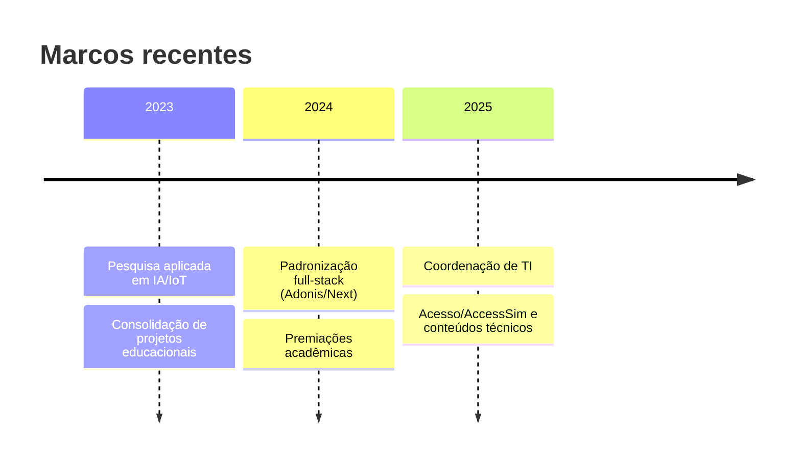

<!--
README de Perfil — Felipe Jovino (Jovinull)
Estratégia: 100% "offline-first" (sem depender de serviços externos dinâmicos).
Coloque os arquivos abaixo em ./assets/ e ajuste os caminhos:

[ASSETS OBRIGATÓRIOS]
- ./assets/banner.png                (1400x320 ou 1920x400 — capa do perfil)
- ./assets/avatar.png                (opcional — recorte quadrado)
- ./assets/icons/*.svg               (ícones da stack, se quiser)
- ./assets/projetos/domuserve.png    (screenshot leve do DomuServer/IoT)
- ./assets/projetos/snake-ia.png     (screenshot leve do Snake-IA)
- ./assets/projetos/tramix.png       (screenshot leve do Tramix — pode ser wireframe)
- ./assets/projetos/portfolio.png    (screenshot da landing/portfolio)
- ./assets/projetos/signforest.png   (screenshot do SignForest)
- ./assets/projetos/irriga.png       (screenshot do IrrigaControll)
- ./assets/slides/                   (PDFs de talks, se tiver)
-->

<p align="center">
  
</p>

<h1 align="center">Felipe Jovino</h1>
<p align="center">
  IT Coordinator · Full-Stack (AdonisJS/Next.js) · AI/ML Research · IoT/ESP32 · Educador · CTO @ AccessSim
</p>

<p align="center">
  <a href="#sobre-mim">Sobre</a> ·
  <a href="#agora">Agora</a> ·
  <a href="#projetos-destaque">Projetos</a> ·
  <a href="#stack">Stack</a> ·
  <a href="#publicacoes--reconhecimentos">Publicações & Reconhecimentos</a> ·
  <a href="#linha-do-tempo">Linha do tempo</a> ·
  <a href="#contato">Contato</a>
</p>

---

## Sobre mim
Sou desenvolvedor full-stack com foco em **AdonisJS v6, Next.js e PostgreSQL**, pesquisador em **IA/ML** e entusiasta de **IoT/ESP32**. Trabalho guiado por arquitetura limpa, documentação sólida e entrega consistente — alinhando engenharia a impacto real (saúde pública, acessibilidade e educação). Coordeno times, escrevo e ensino para que boas soluções sejam replicáveis e manteníveis.

- **Hoje:** Coordenação de TI e liderança técnica, padronizando processos (GitFlow, CI/CD, qualidade) e entregas full-stack.
- **P&D:** Visão computacional e aprendizado de máquina aplicados; soluções locais/privadas quando necessário.
- **Educação:** Produção de conteúdo técnico que encurta a curva de aprendizado com exemplos práticos e contexto.

> *“Software robusto nasce de clareza: boas interfaces, dados bem modelados e processos previsíveis.”*

---

## Agora
- **Sistemas**: padronização de camadas (Controller → Service → Repository), validações com **VineJS**, RBAC e testes.
- **Frontend**: Next.js (App Router), **Tailwind** e design consistente (modo escuro/tema).
- **Pesquisa**: pipelines de **ML** reprodutíveis e LoRA local; experimentos de **RL** no jogo Snake.
- **Conteúdo**: capítulos técnicos sobre **Ciclo HTTP & HttpContext**, **Config/ENV** e **Lucid**.

---

## Projetos (destaque)

<table>
  <tr>
    <td width="50%">
      
      <h3>DomuServer (privado)</h3>
      <p>Sistema embarcado IoT em <strong>ESP32</strong> com DHT22/HC-SR04/MQ-02, arquitetura em máquina de estados (baseada em <code>millis()</code>) e comunicação assíncrona via MQTT.</p>
      <p><strong>Tags:</strong> mqtt · iot · esp32 · sensores</p>
    </td>
    <td width="50%">
      
      <h3><a href="https://github.com/Jovinull/Snake-IA">Snake-IA</a></h3>
      <p>Agente com <strong>Deep Q-Learning</strong> jogando Snake, com replay buffer e melhorias de treinamento.</p>
      <p><strong>Stack:</strong> Python · RL</p>
    </td>
  </tr>
  <tr>
    <td>
      
      <h3>Tramix (privado)</h3>
      <p><em>API</em> em <strong>AdonisJS 6 / Node 22</strong> com autenticação JWT, gestão de usuários/tarefas e arquitetura em camadas. Front em <strong>Next.js 15</strong> com drag-and-drop e integração segura.</p>
      <p><strong>Repos:</strong> <em>tramix-api</em> · <em>tramix-client</em></p>
    </td>
    <td>
      
      <h3><a href="https://github.com/Jovinull/portfolio">Portfolio</a></h3>
      <p>Site pessoal com seções de projetos, stack e contato. Base para assets e links públicos.</p>
      <p><strong>Stack:</strong> TypeScript · Next.js · Tailwind</p>
    </td>
  </tr>
  <tr>
    <td>
      
      <h3><a href="https://github.com/Jovinull/SignForest">SignForest</a></h3>
      <p>Reconhecimento de sinais em Libras com MediaPipe e Random Forest; scripts para dataset e treino.</p>
      <p><strong>Stack:</strong> Python · CV/ML</p>
    </td>
    <td>
      
      <h3><a href="https://github.com/Jovinull/IrrigaControll">IrrigaControll</a></h3>
      <p>Automação de irrigação com <strong>ESP32</strong> e dashboard em Flask; foco em eficiência de água.</p>
      <p><strong>Stack:</strong> C++ · Flask · IoT</p>
    </td>
  </tr>
</table>

<details>
  <summary><strong>Mais repositórios</strong> (abrir)</summary>

- <a href="https://github.com/Jovinull/aracaju-mais-digital">aracaju-mais-digital</a> — TypeScript · projeto público
- <a href="https://github.com/Jovinull/AppletPlayground">AppletPlayground</a> — Java (compatível JDK 8/OpenJDK8)
- <a href="https://github.com/Jovinull/landingpage-acesssim">landingpage-acesssim</a> — TypeScript
- <a href="https://github.com/Jovinull/cad-preproc">cad-preproc</a> — Python
- <a href="https://github.com/Jovinull/Valtherium">Valtherium</a> — (público)
- <a href="https://github.com/Jovinull/idle-mine-redux">idle-mine-redux</a> — fork JS
- <a href="https://github.com/Jovinull/glicemy-back">glicemy-back</a> — Node/Express/Prisma (privado)
- <a href="https://github.com/Jovinull/LeafLink">LeafLink</a> — B+ Tree em Python (público)
- <a href="https://github.com/Jovinull/Image-Showcase">Image-Showcase</a> — Flask + Bootstrap
- <a href="https://github.com/Jovinull/Flask-Web">Flask-Web</a> — Monólito Flask + MySQL
- <a href="https://github.com/Jovinull/Estrutura-Dados-Python">Estrutura-Dados-Python</a>
- <a href="https://github.com/Jovinull/Breast-Cancer">Breast-Cancer</a>
- <a href="https://github.com/Jovinull/Two-Player-PyChess">Two-Player-PyChess</a>
- <a href="https://github.com/Jovinull/IoT-Gestao-Residuos-Solidos-Urbanos">IoT-Gestão-Resíduos</a>
</details>

---

## Stack
**Linguagens:** TypeScript · JavaScript · Python · Java · C/C++  
**Back-end:** AdonisJS 6 (Lucid, VineJS/Bouncer) · Node/Express · Flask · PostgreSQL · Prisma · JWT/RBAC  
**Front-end:** Next.js (App Router/SSR) · React · Tailwind · MUI · Zustand  
**IA/ML:** scikit-learn · (PyTorch quando necessário) · Rasa · Whisper  
**IoT:** ESP32 · MQTT · React Native (Expo)  
**Dev-Ops:** Git/GitHub · Docker · Vercel · Linux

> Ícones locais opcionais em <code>./assets/icons/</code> — ex.: <code></code>.

---

## Publicações & Reconhecimentos
- **Artigos:** *Acesso à formação em IA para pessoas de baixa renda (Estudo de Caso em Sergipe)* · *Fronteiras entre humanidade e tecnologia: a ética da IA*.  
- **Certificações:** Oracle Cloud Infrastructure — AI Foundations Associate.  
- **Prêmios:** Melhor Artigo (SEMEXT/IFS) · Segundo Melhor Artigo (SNCT/IFS).

---

## Snippets (estilo de código)

```ts
// Contrato base de Service em AdonisJS v6
export interface IService<T, CreateDTO, UpdateDTO> {
  index(params?: Partial<T>): Promise<T[]>
  show(id: string | number): Promise<T>
  store(payload: CreateDTO): Promise<T>
  update(id: string | number, payload: UpdateDTO): Promise<T>
  destroy(id: string | number): Promise<void>
}
````

```python
# Pipeline simples de features para séries temporais
def add_indicators(df):
    df["sma_10"] = df["close"].rolling(10).mean()
    df["ema_10"] = df["close"].ewm(span=10, adjust=False).mean()
    return df.bfill()
```

---

## Linha do tempo



---

## Idiomas

Português (nativo) · Inglês (profissional) · Espanhol (profissional) · Libras (intermediário)

---

## Contato

* **E-mail:** [felipejovinogamerplay@gmail.com](mailto:felipejovinogamerplay@gmail.com)
* **GitHub:** <a href="https://github.com/Jovinull">github.com/Jovinull</a>
* **LinkedIn:** <a href="https://www.linkedin.com/in/jobas">linkedin.com/in/jobas</a>
* **Lattes:** <a href="http://lattes.cnpq.br/8481399564892228">lattes.cnpq.br/8481399564892228</a>

---

<p align="center">
  <sub>Este README usa apenas Markdown/HTML nativos do GitHub e imagens locais em <code>./assets</code>.</sub>
</p>
