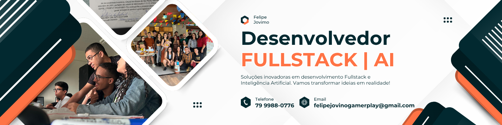
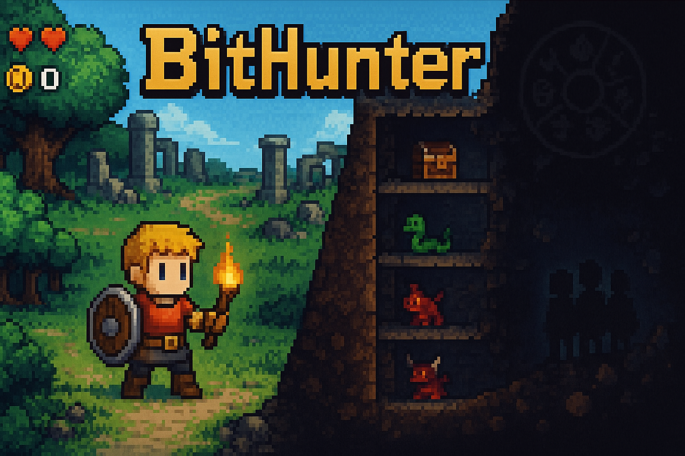
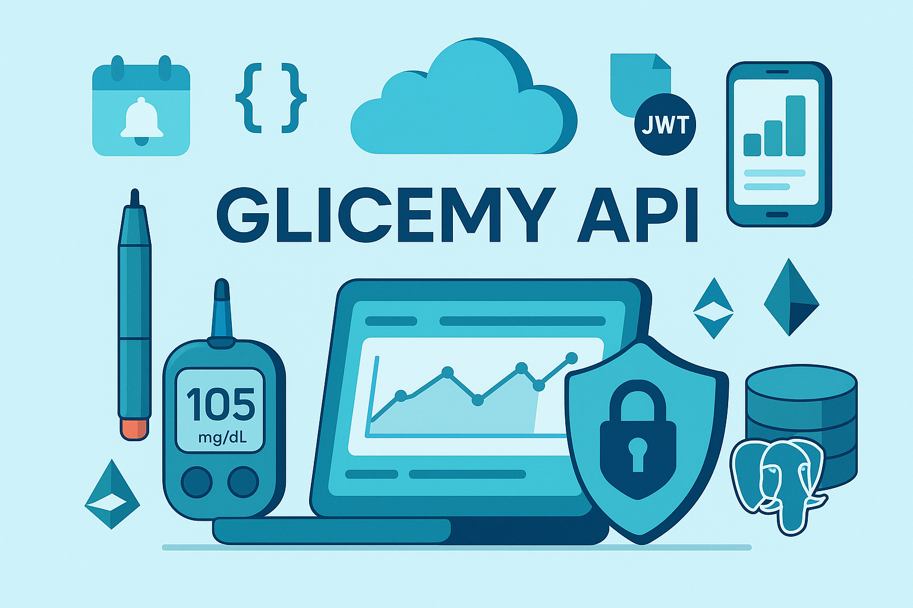
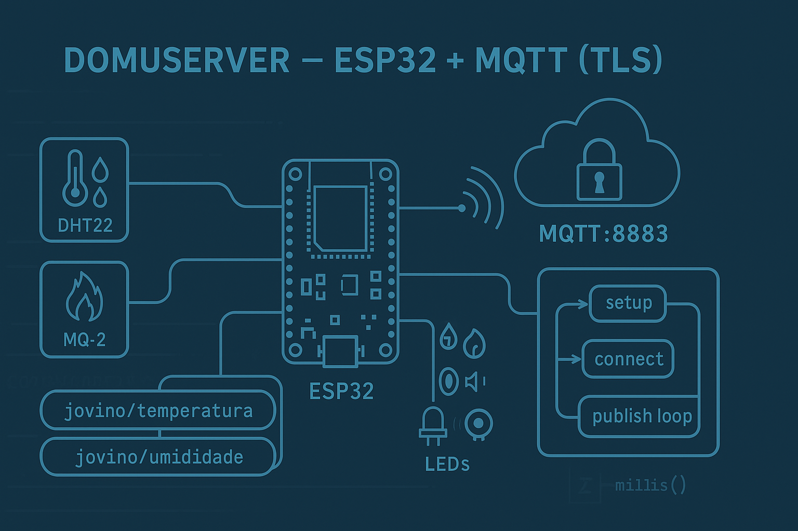
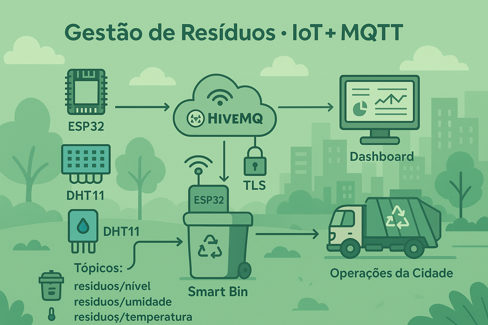
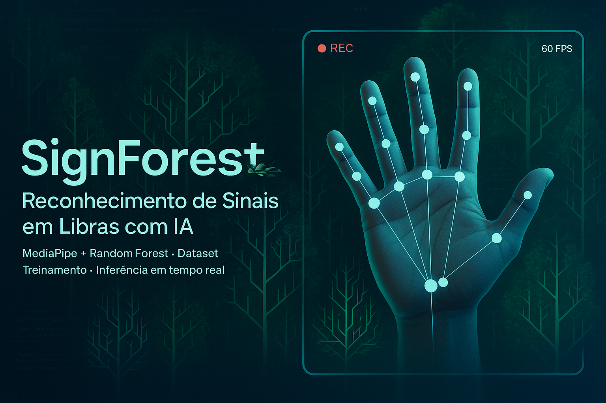
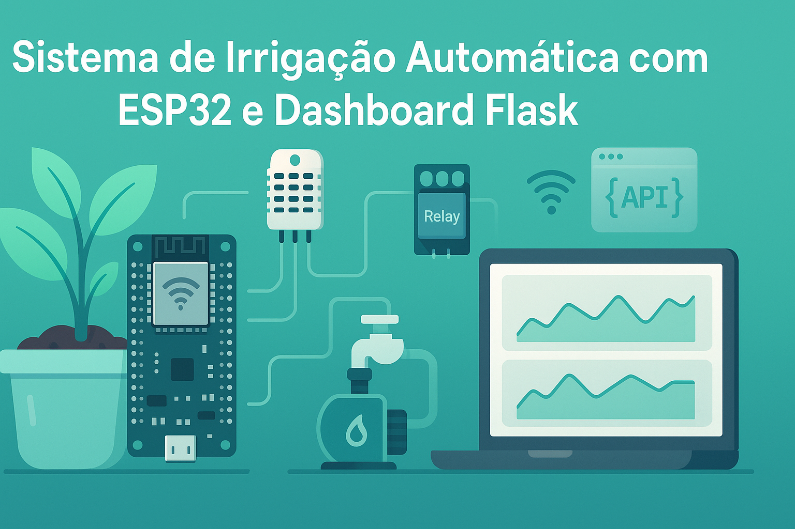
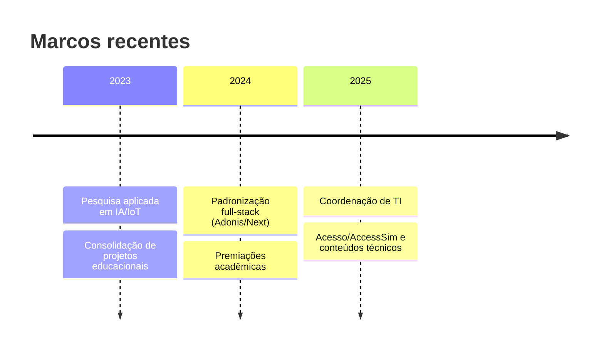

<p align="center">
  
</p>

<h1 align="center">Felipe Jovino</h1>
<p align="center">
  IT Coordinator · Full-Stack (AdonisJS/Next.js) · AI/ML Research · IoT/ESP32 · Educador · CTO @ AccessSim
</p>

<p align="center">
  <a href="#sobre-mim">Sobre</a> ·
  <a href="#agora">Agora</a> ·
  <a href="#projetos-destaque">Projetos</a> ·
  <a href="#stack">Stack</a> ·
  <a href="#publicacoes--reconhecimentos">Publicações & Reconhecimentos</a> ·
  <a href="#linha-do-tempo">Linha do tempo</a> ·
  <a href="#contato">Contato</a>
</p>

---

## Sobre mim
Sou desenvolvedor full-stack com foco em **AdonisJS v6, Next.js e PostgreSQL**, pesquisador em **IA/ML** e entusiasta de **IoT/ESP32**. Trabalho guiado por arquitetura limpa, documentação sólida e entrega consistente — alinhando engenharia a impacto real (saúde pública, acessibilidade e educação). Coordeno times, escrevo e ensino para que boas soluções sejam replicáveis e manteníveis.

- **Hoje:** Coordenação de TI e liderança técnica, padronizando processos (GitFlow, CI/CD, qualidade) e entregas full-stack.
- **P&D:** Visão computacional e aprendizado de máquina aplicados; soluções locais/privadas quando necessário.
- **Educação:** Produção de conteúdo técnico que encurta a curva de aprendizado com exemplos práticos e contexto.

> *“Software robusto nasce de clareza: boas interfaces, dados bem modelados e processos previsíveis.”*

---

## Agora
- **Sistemas**: padronização de camadas (Controller → Service → Repository), validações com **VineJS**, RBAC e testes.
- **Frontend**: Next.js (App Router), **Tailwind** e design consistente (modo escuro/tema).
- **Pesquisa**: pipelines de **ML** reprodutíveis e LoRA local; experimentos de **RL** no jogo Snake.
- **Conteúdo**: capítulos técnicos sobre **Ciclo HTTP & HttpContext**, **Config/ENV** e **Lucid**.

---

## Projetos (destaque)

<!-- Assets esperados em ./assets/projetos/:
bithunter.png | glicemy.png | domuserve.png | iot-residuos.png | signforest.png | irriga.png
-->

<table>
  <tr>
    <td width="50%" valign="top">
      <a href="https://github.com/Jovinull/BitHunter">
        
      </a>
      <h3><a href="https://github.com/Jovinull/BitHunter">BitHunter</a></h3>
      <p>RPG 2D top-down de ação/exploração com progressão longa e dungeons infinitas. Ciclo central: explorar → enfrentar → coletar → evoluir. Foco em leitura visual clara, desempenho e balanceamento transparente. Stack: Java + AWT/Swing.</p>
    </td>
    <td width="50%" valign="top">
      <a href="https://github.com/Jovinull/glicemy-back">
        
      </a>
      <h3><a href="https://github.com/Jovinull/glicemy-back">Glicemy</a></h3>
      <p>API para gestão de Diabetes: glicemia, medicamentos, lembretes e relatórios. Segurança por padrão: JWT, criptografia e integrações com dispositivos. Stack: Node/Express · TS · PostgreSQL/Prisma.</p>
    </td>
  </tr>
  <tr>
    <td width="50%" valign="top">
      
      <h3>DomusServer + DomusLink</h3>
      <p>Plataforma IoT em ESP32 com DHT22/HC-SR04/MQ-02 e MQTT/TLS. Máquina de estados (millis) para execução assíncrona, módulos independentes e tópicos padronizados. Objetivo: telemetria em tempo real, segurança (8883) e modularidade.</p>
    </td>
    <td width="50%" valign="top">
      <a href="https://github.com/Jovinull/IoT-Gestao-Residuos-Solidos-Urbanos">
        
      </a>
      <h3><a href="https://github.com/Jovinull/IoT-Gestao-Residuos-Solidos-Urbanos">IoT — Gestão de Resíduos</a></h3>
      <p>Arquitetura IoT para gestão de resíduos urbanos com MQTT, coleta em tempo real e camada de aplicação. Conecta revisão de literatura, desenho arquitetural e implementação prática.</p>
    </td>
  </tr>
  <tr>
    <td width="50%" valign="top">
      <a href="https://github.com/Jovinull/SignForest">
        
      </a>
      <h3><a href="https://github.com/Jovinull/SignForest">SignForest</a></h3>
      <p>Reconhecimento de sinais em Libras com MediaPipe (landmarks de mãos) + Random Forest. Scripts de dataset, treino, busca de hiperparâmetros e inferência em tempo real.</p>
    </td>
    <td width="50%" valign="top">
      <a href="https://github.com/Jovinull/IrrigaControll">
        
      </a>
      <h3><a href="https://github.com/Jovinull/IrrigaControll">IrrigaControll</a></h3>
      <p>Sistema de irrigação com ESP32, DHT22 e sensor de solo. Controle de relé por leitura ambiental, API HTTP embarcada e dashboard Flask para visualização.</p>
    </td>
  </tr>
</table>

<!-- Linha em branco após HTML ajuda o GFM a não confundir blocos -->

<details>
  <summary><strong>Mais repositórios</strong> (abrir)</summary>

- <a href="https://github.com/Jovinull/aracaju-mais-digital">aracaju-mais-digital</a> — Portal com Next.js/TypeScript.
- <a href="https://github.com/Jovinull/AppletPlayground">AppletPlayground</a> — Experimentos em Java (compatível JDK 8/OpenJDK8).
- <a href="https://github.com/Jovinull/landingpage-acesssim">landingpage-acesssim</a> — Landing page institucional em TypeScript.
- <a href="https://github.com/Jovinull/cad-preproc">cad-preproc</a> — Pré-processamento em Python para cadastros/datasets.
- <a href="https://github.com/Jovinull/Valtherium">Valtherium</a> — Prototipação de mecânicas e sistemas.
- <a href="https://github.com/Jovinull/idle-mine-redux">idle-mine-redux</a> — Incremental web game (fork) em JavaScript.
- <a href="https://github.com/Jovinull/glicemy-back">glicemy-back</a> — API Node/Express/Prisma para gerenciamento glicêmico.
- <a href="https://github.com/Jovinull/LeafLink">LeafLink</a> — Árvore B+ em Python com CLI e persistência.
- <a href="https://github.com/Jovinull/Image-Showcase">Image-Showcase</a> — Galeria com Flask + Bootstrap.
- <a href="https://github.com/Jovinull/Flask-Web">Flask-Web</a> — CRUD de produtos/categorias (Flask + MySQL).
- <a href="https://github.com/Jovinull/Estrutura-Dados-Python">Estrutura-Dados-Python</a> — Implementações práticas de EDs.
- <a href="https://github.com/Jovinull/Breast-Cancer">Breast-Cancer</a> — Classificação com redes neurais (UCI dataset).
- <a href="https://github.com/Jovinull/Two-Player-PyChess">Two-Player-PyChess</a> — Xadrez para dois em Python/Pygame.
- <a href="https://github.com/Jovinull/IoT-Gestao-Residuos-Solidos-Urbanos">IoT-Gestão-Resíduos</a> — Arquitetura IoT com MQTT para monitoramento.
</details>

---

## Stack

<!-- Faixa de ícones (apenas o que existe em ./assets/icons). Use height/width em atributos, não em style. -->
<p align="center">
  
  
  
  
  
  
  
  
  
  
  
  
</p>

**Linguagens:** TypeScript · JavaScript · Python · Java · C/C++  
**Back-end:** AdonisJS 6 (Lucid, VineJS/Bouncer) · Node/Express · Flask · PostgreSQL · JWT/RBAC  
**Front-end:** Next.js (App Router/SSR) · React · Tailwind · Zustand  
**IA/ML:** scikit-learn · (PyTorch quando necessário) · Rasa · Whisper  
**IoT:** ESP32/Arduino · MQTT · React Native (Expo)  
**Dev-Ops:** Git/GitHub · Docker · Vercel · Linux

<!-- Grade responsiva somente com ícones que você tem no repo -->
<table>
  <tr>
    <td align="center"><br><sub>AdonisJS</sub></td>
    <td align="center"><br><sub>Next.js</sub></td>
    <td align="center"><br><sub>React</sub></td>
    <td align="center"><br><sub>TypeScript</sub></td>
    <td align="center"><br><sub>Node.js</sub></td>
    <td align="center"><br><sub>PostgreSQL</sub></td>
  </tr>
  <tr>
    <td align="center"><br><sub>Python/ML</sub></td>
    <td align="center"><br><sub>Java</sub></td>
    <td align="center"><br><sub>Tailwind</sub></td>
    <td align="center"><br><sub>Docker</sub></td>
    <td align="center"><br><sub>VS Code</sub></td>
    <td align="center"><br><sub>Arduino/ESP32</sub></td>
  </tr>
</table>

> Nota: GitHub sanitiza HTML no README (remove CSS/`style` e afins); coloque **uma linha em branco** para sair de blocos HTML antes de continuar em Markdown.  

---

## Publicações & Reconhecimentos
- **Artigos:** *Acesso à formação em IA para pessoas de baixa renda (Estudo de Caso em Sergipe)* · *Fronteiras entre humanidade e tecnologia: a ética da IA*.  
- **Certificações:** Oracle Cloud Infrastructure — AI Foundations Associate.  
- **Prêmios:** Melhor Artigo (SEMEXT/IFS) · Segundo Melhor Artigo (SNCT/IFS).

---

## Snippets (estilo de código)

```ts
// Contrato base de Service em AdonisJS v6
export interface IService<T, CreateDTO, UpdateDTO> {
  index(params?: Partial<T>): Promise<T[]>
  show(id: string | number): Promise<T>
  store(payload: CreateDTO): Promise<T>
  update(id: string | number, payload: UpdateDTO): Promise<T>
  destroy(id: string | number): Promise<void>
}
````

```python
# Pipeline simples de features para séries temporais
def add_indicators(df):
    df["sma_10"] = df["close"].rolling(10).mean()
    df["ema_10"] = df["close"].ewm(span=10, adjust=False).mean()
    return df.bfill()
```

---

## Linha do tempo



---

## Idiomas

Português (nativo) · Inglês (profissional) · Espanhol (profissional) · Libras (intermediário)

---

## Contato

* **E-mail:** [felipejovinogamerplay@gmail.com](mailto:felipejovinogamerplay@gmail.com)
* **GitHub:** <a href="https://github.com/Jovinull">github.com/Jovinull</a>
* **LinkedIn:** <a href="https://www.linkedin.com/in/jobas">linkedin.com/in/jobas</a>
* **Lattes:** <a href="http://lattes.cnpq.br/8481399564892228">lattes.cnpq.br/8481399564892228</a>

---

<p align="center">
  <sub>Este README usa apenas Markdown/HTML nativos do GitHub e imagens locais em <code>./assets</code>.</sub>
</p>
