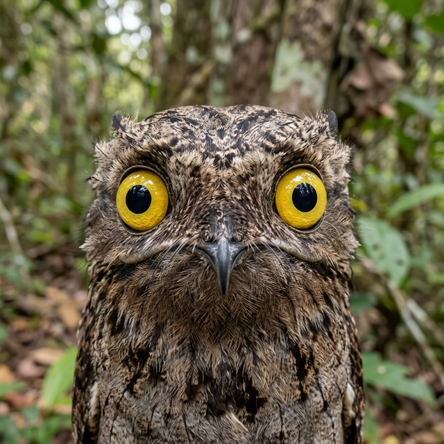

  

<h1 align="center">Felipe Jovino</h1>

<h3 align="center">
  IT Coordinator · Full-Stack (Adonis/Next.js) · AI/ML Research · Educador
</h3>

---

  

    <b>Coordenador de TI na WM Saúde · CTO na AccessSim · Pesquisador em IA (Mestrando UFS)</b> 
    <i>Transformando café e código em soluções de impacto social e acessibilidade.</i>
  

  

    <a href="mailto:felipejovinogamerplay@gmail.com">Contato</a> ·
    <a href="https://www.linkedin.com/in/jobas">LinkedIn</a> ·
    <a href="http://lattes.cnpq.br/8481399564892228">Lattes</a>
  

---

<table width="100%" style="border: none; background: none;">
  <tr style="border: none; background: none;">
    <td width="80%" valign="top" style="border: none;">
      <h3>O que eu ando aprontando:</h3>
      <ul>
        <li><b>No mundo corporativo:</b> Lidero equipes na <b>WM Saúde (SMARTHOSP)</b> e construo ecossistemas robustos com <b>TypeScript, AdonisJS, Next.js e PostgreSQL</b>.</li>
        <li><b>Inovação & Impacto:</b> Sou CTO/Cofundador da <b>AccessSim</b> (IA + AR para acessibilidade) e cofundador da <b>WF3 Solutions</b>.</li>
        <li><b>Academia:</b> Mestrando em Ciência da Computação (UFS/LABIC), focado em <b>Computação Inteligente</b>. Bacharel pelo IFS.</li>
        <li><b>Side Projects:</b> De sistemas logísticos (<b>Nexus WMS/TMS</b>) a jogos indies como <b>BitHunter</b> e <b>AbyssASCII</b>.</li>
        <li><b>Comunidade:</b> Educador no YouTube, tentando tornar a programação menos "grega" para quem está começando.</li>
      </ul>
    </td>
    <td width="20%" valign="middle" align="center" style="border: none;">
        
      
    </td>
  </tr>
</table>

---

  

  Construindo arquiteturas limpas com uma pitada de IA e muita vontade de resolver problemas reais.

 

  <i><a href="https://www.youtube.com/watch?v=lYbYoaBrXpU" style="text-decoration:none; color:inherit;">See You Space Cowboy...</a></i>

