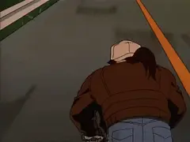

  

<h1 align="center">Felipe Jovino</h1>

<i>I wrote an operating system so I'd have somewhere to run Doom.</i>

---

Things I've built, in no particular order of sanity:

**[StinkOS](https://github.com/Jovinull/StinkOS)** — 32-bit x86 OS from scratch in C. Preemptive scheduler, a TCP/IP stack down to RFC 793, ELF userland, its own package manager. Zero third-party libraries in the kernel. Doom runs on it.

**[sonicheroes](https://github.com/Jovinull/sonicheroes)** — decompiling Sonic Heroes for the GameCube, function by function.

**[macrocosm](https://github.com/Jovinull/macrocosm)** — dark matter particles coupled to a baryonic SPH fluid in expanding spacetime, volumetric rendering included. Pure C17.

**[SmartyRed](https://github.com/Jovinull/SmartyRed)** & **[AwaLink](https://github.com/Jovinull/AwaLink)** — PPO agents learning Pokémon Red and Zelda: Link's Awakening from raw frames. One of them keeps track of roughly 1700 event flags. They are both very patient.

**[rinha-2026-zig](https://github.com/Jovinull/rinha-2026-zig)** — vectorized k-NN over a quantized IVF index. In Zig, without libc, on 0.40 of a vCPU.

**[Bixim](https://github.com/Jovinull/Bixim)** — a Tamagotchi engine that runs on an ESP32 and on your desktop from the same codebase.

**[SignForest](https://github.com/Jovinull/SignForest)** — real-time Libras recognition from a webcam.

 

---

**Day job:** IT Coordinator at WM Saúde (SMARTHOSP), CTO at AccessSim — AI + AR for architectural accessibility, picked up by Sebrae's Catalisa ICT — and a Master's in Intelligent Computing at UFS/LABIC.

**Night job:** everything above.

---

> **Achievement Unlocked: GitHub thought I was a bot**
>
> In June 2026, GitHub's anti-abuse system suspended my account. False positive — Support confirmed it. Apparently committing this much trips the automation. I choose to read this as a compliment.

---

  
    <a href="mailto:felipejovinogamerplay@gmail.com">Email</a> ·
    <a href="https://www.linkedin.com/in/jobas">LinkedIn</a> ·
    <a href="https://lattes.cnpq.br/8481399564892228">Lattes</a> ·
    <a href="https://www.jovinull.com.br/">Portfolio</a>
  

  <i><a href="https://www.youtube.com/watch?v=lYbYoaBrXpU">See You Space Cowboy...</a></i>

  Urutau photo and <i>Golden Boy</i> clip belong to their respective authors. Code here is MIT.

